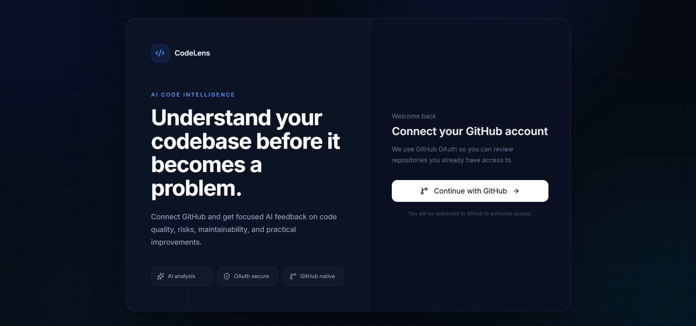
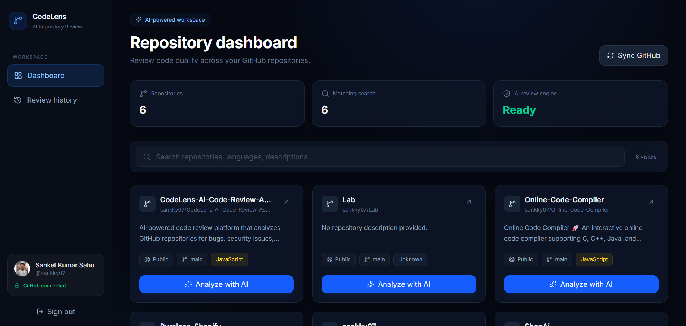
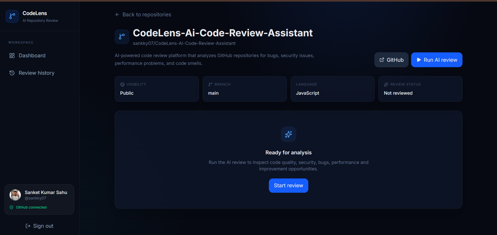
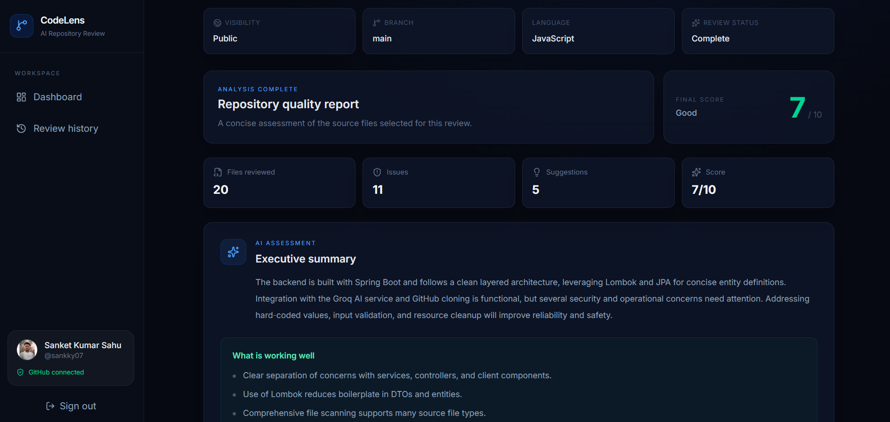
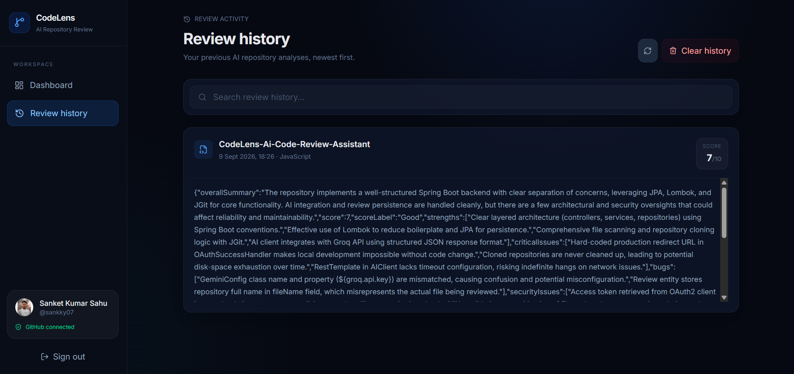

# 🔍 CodeLens — AI Code Review Assistant

> AI-powered GitHub code review platform that analyzes repositories and generates structured, actionable feedback on code quality, bugs, security, performance, code smells, and best practices.

[](https://www.oracle.com/java/)
[](https://spring.io/projects/spring-boot)
[](https://react.dev/)
[](https://vite.dev/)
[](https://www.postgresql.org/)
[](https://tailwindcss.com/)
[](https://github.com/)
[](https://groq.com/)

---

## 🌐 Live Demo

**Live Application:** https://code-lens-ai-code-review-assistant-three.vercel.app

**Source Code:** https://github.com/sankky07/CodeLens-Ai-Code-Review-Assistant

---

## 📌 Overview

CodeLens is a full-stack AI-powered code review platform that connects directly with GitHub.

Developers can authenticate with GitHub, synchronize repositories, select a repository, and run an AI-powered analysis of supported source files.

CodeLens produces a structured review containing:

- Overall code-quality score
- Overall summary
- Strengths
- Critical issues
- Bugs
- Security issues
- Performance issues
- Code smells
- Best practices
- Suggested improvements
- Files reviewed

The goal is to provide fast, understandable, and actionable feedback that can supplement human code review.

---

## ✨ Features

### 🔐 GitHub Authentication
- GitHub OAuth 2.0 authentication
- Server-side session authentication
- User persistence with PostgreSQL
- GitHub access-token management

### 📦 GitHub Repository Integration
- Import repositories from GitHub
- Synchronize repository data
- Browse connected repositories
- Open repository details
- Analyze supported source files

### 🤖 AI-Powered Code Review
CodeLens analyzes source code for:
- 🐛 Bugs and potential logic errors
- 🔒 Security issues
- ⚡ Performance problems
- 🧹 Code smells and maintainability concerns
- ✅ Best-practice violations
- 💡 Suggested improvements

### 📊 Structured Review Results
Reviews are returned as structured data rather than a single unstructured AI response.

```text
Overall Summary
Score
Score Label
Strengths
Critical Issues
Bugs
Security Issues
Performance Issues
Code Smells
Best Practices
Suggested Improvements
Files Reviewed
```

### 📝 Review History
Completed reviews are stored so previous analysis can be revisited through the application.

---

## 🧠 How It Works

```text
GitHub Repository
        │
        ▼
Repository Synchronization
        │
        ▼
Source File Discovery
        │
        ▼
File Filtering & Limits
        │
        ▼
Repository Context
        │
        ▼
Groq LLM Analysis
        │
        ▼
Structured JSON Response
        │
        ▼
Backend Validation
        │
        ▼
PostgreSQL Persistence
        │
        ▼
Frontend Review Dashboard
```

---

## 🏗️ Architecture

```text
                           ┌─────────────────────┐
                           │       GitHub        │
                           │                     │
                           │ OAuth + Repository  │
                           │       API           │
                           └──────────┬──────────┘
                                      │
                              OAuth 2.0 / API
                                      │
                                      ▼
┌────────────────────────────────────────────────────────────┐
│                         CodeLens                            │
│                                                            │
│   ┌──────────────────────┐        REST API                │
│   │    React Frontend    │ ───────────────────────────┐   │
│   │ React + Vite         │                            │   │
│   │ Tailwind + Motion    │                            ▼   │
│   └──────────────────────┘                  ┌─────────────┐
│                                             │ Spring Boot │
│                                             │   Backend   │
│                                             └──────┬──────┘
└────────────────────────────────────────────────────┼────────
                                                     │
                         ┌───────────────────────────┼────────────┐
                         ▼                           ▼            ▼
                  ┌─────────────┐             ┌────────────┐ ┌────────────┐
                  │ PostgreSQL  │             │ GitHub API │ │  Groq LLM  │
                  │ Users       │             │ Repositories││ AI Review  │
                  │ Repositories│             │ & metadata │ │ Analysis   │
                  │ Reviews     │             └────────────┘ └────────────┘
                  └─────────────┘
```

---

## 🛠️ Technology Stack

### Frontend

| Technology | Purpose |
|---|---|
| React 19 | User interface |
| Vite 8 | Frontend tooling and build system |
| Tailwind CSS 4 | Styling |
| Framer Motion | Animations and transitions |
| Axios | HTTP communication |
| React Router | Client-side routing |
| React Hot Toast | Notifications |
| React Markdown | Markdown rendering |
| Lucide React | Icons |

### Backend

| Technology | Purpose |
|---|---|
| Java 21 | Backend language |
| Spring Boot 3.5.x | Application framework |
| Spring Security | Authentication and authorization |
| Spring OAuth2 Client | GitHub OAuth integration |
| Spring Data JPA | Persistence |
| Hibernate | ORM |
| REST APIs | Frontend/backend communication |
| JGit / GitHub API libraries | Repository interaction |
| Maven | Build and dependency management |

### Database

**PostgreSQL**

Used for persistent application data including users, repositories, review results, and review history.

### AI

**Groq API**

CodeLens uses Groq through an OpenAI-compatible API interface. The backend requests structured JSON output from the model and validates the resulting review before returning it to the frontend.

### Deployment

- **Frontend:** Vercel
- **Backend:** Render
- **Database:** Render PostgreSQL

---

## 🔐 Authentication Flow

CodeLens uses GitHub OAuth 2.0.

```text
User
 │
 ▼
CodeLens Login
 │
 ▼
Spring Security OAuth2
 │
 ▼
GitHub Authorization
 │
 ▼
GitHub Callback
 │
 ▼
OAuthSuccessHandler
 │
 ├── Retrieve GitHub user
 ├── Retrieve OAuth access token
 ├── Create/update user
 └── Persist authenticated session
 │
 ▼
Dashboard
```

Protected API endpoints require an authenticated session.

---

## 📂 Repository Analysis

CodeLens discovers and filters source files before constructing the AI review context.

The backend applies practical analysis boundaries, including:
- Maximum number of source files
- Maximum characters per file
- Maximum total review context

This helps control model input size and keeps repository analysis manageable.

---

## 📊 Code Quality Scoring

Each completed review produces a numerical code-quality score and a corresponding label.

Example:

```text
82 / 100
GOOD
```

The backend validates and normalizes the AI-generated score before storing it.

---

## 🖥️ Application Pages

### Login
GitHub OAuth authentication entry point.

### Dashboard
Displays repositories associated with the authenticated GitHub account and provides repository synchronization.

### Repository Review
Displays AI-generated analysis for a selected repository, including score, findings, and recommendations.

### Review History
Provides access to previously completed reviews.

---

## 📡 API

The backend provides REST endpoints for:
- Health checks
- GitHub repository synchronization
- Repository retrieval
- Repository details
- AI review operations
- Review history

### Health Check

```text
GET /api/health
```

### API Documentation

When running locally:

```text
http://localhost:8080/swagger-ui/index.html
```

---

## 🚀 Deployment

```text
                 ┌──────────────┐
                 │   Vercel     │
                 │   Frontend   │
                 └──────┬───────┘
                        │
                     REST API
                        │
                        ▼
                 ┌──────────────┐
                 │   Render     │
                 │ Spring Boot  │
                 └──────┬───────┘
                        │
              ┌─────────┼─────────┐
              ▼         ▼         ▼
         PostgreSQL  GitHub API  Groq
```

---

## ⚙️ Local Development

### Prerequisites

- Java 21
- Node.js and npm
- PostgreSQL
- Git
- GitHub OAuth application
- Groq API key

### Clone

```bash
git clone https://github.com/sankky07/CodeLens-Ai-Code-Review-Assistant.git
cd CodeLens-Ai-Code-Review-Assistant
```

### Backend

```bash
cd backend
```

Configure:

```text
DATABASE_URL
DATABASE_USERNAME
DATABASE_PASSWORD
GITHUB_CLIENT_ID
GITHUB_CLIENT_SECRET
JWT_SECRET
JWT_EXPIRATION
GROQ_API_KEY
```

Run on Windows:

```bash
mvnw.cmd spring-boot:run
```

Run on Linux/macOS:

```bash
./mvnw spring-boot:run
```

Backend:

```text
http://localhost:8080
```

Health check:

```text
http://localhost:8080/api/health
```

### Frontend

```bash
cd frontend
npm install
npm run dev
```

Frontend:

```text
http://localhost:5173
```

Local API:

```text
VITE_API_URL=http://localhost:8080
```

---

## 🔑 Environment Variables

Secrets must never be committed to source control.

### Backend

```text
DATABASE_URL
DATABASE_USERNAME
DATABASE_PASSWORD
GITHUB_CLIENT_ID
GITHUB_CLIENT_SECRET
GROQ_API_KEY
JWT_SECRET
JWT_EXPIRATION
```

### Frontend

```text
VITE_API_URL
```

Use environment-specific values for local and production deployments.

---

## 🔒 Security

CodeLens uses:
- GitHub OAuth 2.0
- Spring Security
- Protected API endpoints
- Server-side authenticated sessions
- Secure production cookies
- HTTPS in production
- Environment-based secret configuration
- Repository analysis limits

Never commit API keys, OAuth secrets, database passwords, JWT secrets, `.env` files, or production configuration containing credentials.

---

## 🧪 Error Handling

The application handles common failure scenarios including:
- GitHub authentication failures
- GitHub API failures
- Repository synchronization failures
- Invalid repository requests
- AI analysis failures
- Unsupported source files
- Large repository analysis limits
- Database errors

The frontend provides user-facing feedback instead of exposing internal implementation details.

---

## 📁 Project Structure

```text
CodeLens-Ai-Code-Review-Assistant/
│
├── backend/
│   ├── src/
│   │   ├── main/
│   │   │   ├── java/
│   │   │   │   └── com/sanket/backend/
│   │   │   │       ├── auth/
│   │   │   │       ├── controller/
│   │   │   │       ├── entity/
│   │   │   │       ├── repository/
│   │   │   │       ├── security/
│   │   │   │       ├── service/
│   │   │   │       └── ...
│   │   │   └── resources/
│   │   └── test/
│   ├── Dockerfile
│   ├── pom.xml
│   └── mvnw
│
├── frontend/
│   ├── src/
│   │   ├── components/
│   │   ├── pages/
│   │   ├── routes/
│   │   ├── services/
│   │   └── ...
│   ├── public/
│   ├── package.json
│   ├── vite.config.js
│   └── vercel.json
│
├── .gitignore
├── README.md
└── LICENSE
```

---

## 🧩 Engineering Highlights

### Structured AI Output
AI responses are requested in JSON format and mapped into a structured review model.

### Analysis Boundaries
Repository analysis is bounded by file count and character limits to control model input size.

### Separation of Concerns
The application separates UI presentation, REST APIs, business logic, authentication, GitHub integration, AI analysis, and persistence.

### Production Deployment
Frontend, backend, and database are deployed as separate services.

---

## 🚧 Current Limitations

- AI-generated findings should be verified by a developer.
- Very large repositories require analysis limits.
- Review quality depends on the source-code context supplied to the model.
- AI analysis depends on external model/API availability.
- The current workflow focuses on repository analysis rather than automated pull-request comments.

---

## 🔮 Future Improvements

- [ ] GitHub Pull Request integration
- [ ] Automated PR reviews
- [ ] Inline GitHub review comments
- [ ] Review comparison between commits
- [ ] Support for additional programming languages
- [ ] Team and project workspaces
- [ ] Custom review rules
- [ ] Configurable severity levels
- [ ] CI/CD integration
- [ ] Code-quality analytics
- [ ] Quality trends over time
- [ ] Streaming AI review results
- [ ] Advanced security analysis
- [ ] Review export

---

## 🎯 Project Goals

CodeLens was built to explore how modern AI systems can be integrated into a real developer workflow.

The project combines:
- Full-stack web development
- OAuth authentication
- GitHub API integration
- REST API design
- Relational database persistence
- LLM-powered analysis
- Structured AI responses
- Cloud deployment

CodeLens is designed to **assist developers, not replace human code review**.

---

## 📸 Screenshots

Add production screenshots to a `docs/` directory.

### Login



### Dashboard



### Repository



### AI Code Review



### Review History



---

## 📊 Project Summary

| Area | Technology |
|---|---|
| Frontend | React 19 + Vite 8 |
| Styling | Tailwind CSS 4 |
| Backend | Java 21 + Spring Boot 3.5 |
| Authentication | GitHub OAuth 2.0 |
| Database | PostgreSQL |
| ORM | JPA / Hibernate |
| AI | Groq API |
| API | REST |
| Repository Integration | GitHub API |
| Frontend Deployment | Vercel |
| Backend Deployment | Render |
| Database Hosting | Render PostgreSQL |

---

## 👨‍💻 Author

### Sanket Sahu

Software Developer interested in:
- Full-Stack Development
- Java & Spring Boot
- React
- AI / LLM Applications
- Python
- Developer Tools

**GitHub:**  
https://github.com/sankky07

---

## ⭐ Support

If you find CodeLens useful or interesting, consider giving the repository a ⭐ on GitHub.

---

<p align="center">
  Built with ☕ Java, ⚛️ React, 🤖 AI, and a lot of debugging.
</p>
